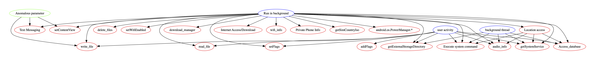
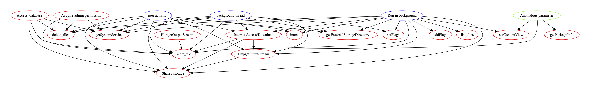
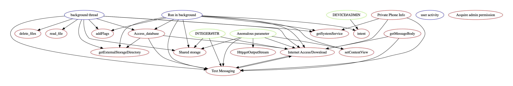
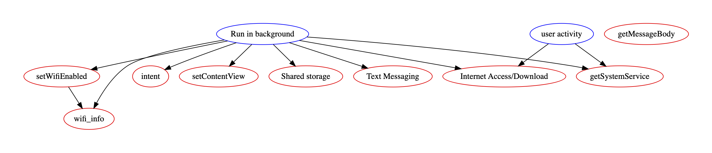
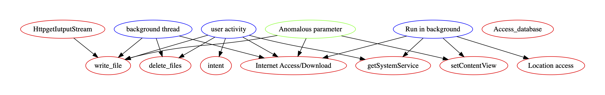

We are working on a new malware detection tool which uses a
novel graph representation as the program semantic abstraction,
in order to enable better performance when the labelled graphs
are used with a machine learning to, for example, classifying malware categories.

This post is not a paper, but as a case analysis to show the current capability of our tool
and foster discussion.
We intentionally hide some details as our work is still
under submission. However, welcome to contact me (zgzhen@cs.washington.edu) for details.

Below, we will show a subset of representative outputs from our tool when running end-to-end.
We will also briefly explain the graph and why it matches with the ground-truth label.

## Benign sample

Benign sample is a non-malicious sample. We have a set of benign samples that is very easy to mistake as malicious ones.
In this sample, the only suspicious behaviour is a dependency from background activity to SMS related operation.
However, this is not a strong pattern, thus being classifier as "benign".

APK: examples/benign-1.apk
(Please contact author if you need access to these APKs)

## Trojan

*Trojan* is an application that appears to be benign and performs undesirable actions against the user.
In this sample, we captured the relationship between "Run in background" and "Execute system command/Root privilege escalation"

APK: `examples/trojan-1.apk`

## Backdoor

Backdoor is an application that allows the execution of unwanted, potentially harmful, remote-controlled operations on a device.

This sample shows the use of API `java.lang.Runtime.exec` to run shell scripts in the background.

APK: `examples/backdoor-1.apk`

## Hostile downloader

*Hostile downloader* will download other potentially harmful applications without consensus from users. The diagram captures the core dependency as an edge from "HttpgetOutputStream" and "Internet Access/Download " to "write_file", under the "background thread" context

APK: `examples/downloader-1.apk`

## Phising

*Phishing* app pretends to come from a trustworthy source, request a users authentication credentials and/or billing information,and send the data to a third party.

In our abstraction, an edge from "Anomalous parameter" (e.g. a very large integer number) to `setContentView` shows that the app tries to overlay the user interface with a large
cover dynamically, which potentially indicates the malicious intention of faking UI.

APK: `examples/phishing-1.apk`

## SMS Fraud

*SMS fraud* will charge users to send premium SMS without consent, or tries to disguise its SMS activities by hiding disclosure agreements.

The core behavior will be sending SMS messages in background ("Run in background -> Text Messaging").

APK: `examples/sms-1.apk`

## Spyware

*Spyware* transmits sensitive information off the device.

In this abstraction, you can observe the use of information source and information sink. Due to the limitation of static analysis,
it is difficult to find a data-flow dependency directly between source and sink. But our abstraction can show their co-existence, which can also be useful.